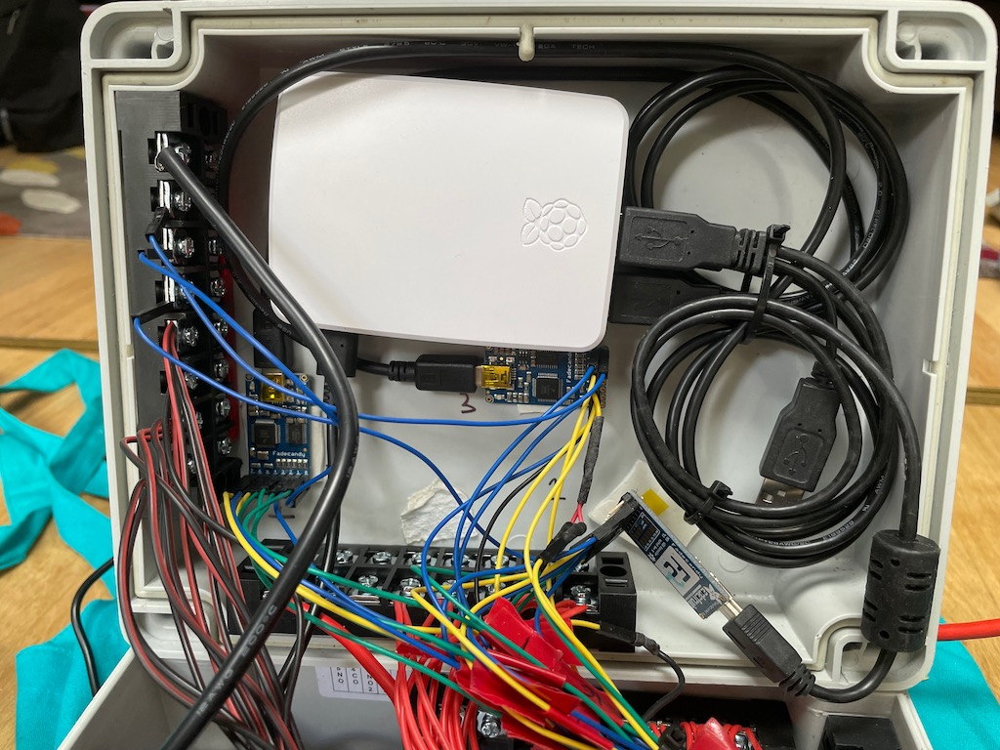

# V2 Geodesic Dome

4m dome using [hubs](https://buildwithhubs.co.uk) with 1500 RGB LEDs controlled via 3 Fadecandies connected to a RPi running visualisations created in Processing.


# Overview of setup

Kit:
- Build with Hubs kit
- Broom handles (30 short and 35 long)
- LED Strips - WS2812B Individually Addressable, 5050 RGB SMD (Outdoor / waterproof) 
- RPi 
- Fadecandy
- PSU - Mean Well RSP-320-5 AC/DC Enclosed Power Supply (PSU) 300W 5V 60A

To build, start by constucting the dome, mount the control box to the apex, attach the lights in the sequence 1-25 using the setup pattern below, power up RPi and run scripts to check all LEDs are working, raise the dome half a metre to create a little more head height and to create door (which requres removal of one member).

# Dome
Am using a [V2 dome](http://www.domerama.com/calculators/2v-geodesic-dome-calculator/) using a [hubs](https://buildwithhubs.co.uk) kit to connect broom handles of length.

Build with Hubs have great [instructions for assemby](https://buildwithhubs.co.uk/downloads.html) which are also saved [in this repo](images/hubs-build-instructions.pdf)


# LED Setup


# Fadecandy

Lots of resources online for getting started with [Fadecandy](https://github.com/scanlime/fadecandy) (the [previous Fadecandy README](https://github.com/scanlime/fadecandy/blob/8934a74e8140849e84cf2eab9e0c3323900891a9/README.md) has more info than the current.)

> Note: system uses 3 Fadecandies which can drive 8 strips each or 24 in total -  but we have 25 LED STRIPS so strip  25 uses strip 20 data (if you look in box you will see two data wires spliced into one input in fadecandy 3).

LED strip layout for OPC control below was created using geodesic_layout_test sketch.


Sketch of wiring up Fadecandies to RPi


# Images





# Notes from first setup of fadecandy on RPi

RPI4 used to host fadecandy server and connect to multiple fadecandy’s in turn hosting multiple RGB LED strips.

Setup [Raspian Buster Desktop](https://www.raspberrypi.org/downloads/raspbian/) since wanted to be able to VNC in to machine and set up Pi as access point for deployment in field.

Flashed SD with [Etcher](https://www.balena.io/etcher/), before inserting into pi added a ssh file to root folder ([step 3 in these docs](https://www.raspberrypi.org/documentation/remote-access/ssh/))

Setup fadecandy server - [followed these instructions](https://learn.adafruit.com/1500-neopixel-led-curtain-with-raspberry-pi-fadecandy/fadecandy-server-setup) - and then test fcserver is working by running 

```sudo fcserver```

Followed instructions on adafruit for fadecandy auto start. Used example of autorunning processing sketch [from here](https://electricnoodlebox.wordpress.com/tutorials/processing-raspberry-pi-auto-run-a-sketch-on-boot/), but location of autostart files on debian 10.1 moved to here: 

```/etc/xdg/lxsession/LXDE-pi/autostart```